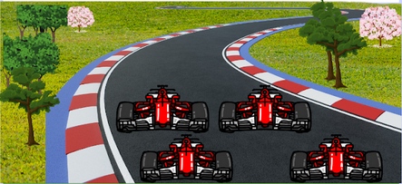
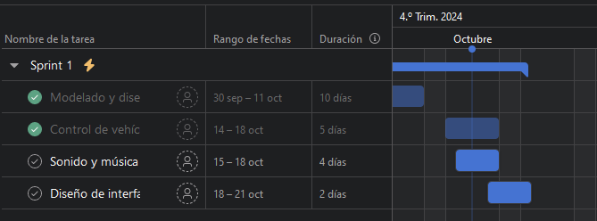
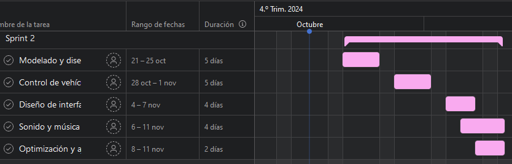
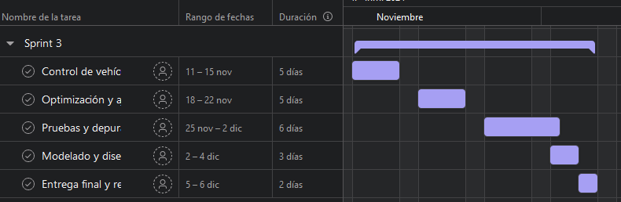

## Documentación precisa de Formula Azteca
El vidojuego es una propuesta que se basa en las ideas de los integrantes, considerando sus gustos y los posibles gustos del usuario.
Objetivo de Fórmula Azteca:
Aprender y mejorar habilidades en el desarrollo de videojuegos, enfocándose en la creación de mecánicas, diseño de niveles, optimización gráfica e inteligencia artificial, mientras se trabaja en equipo para crear un juego de carreras único
## Formula Azteca empieza aqui 👇

<h1 align="center">Formula Azteca</h1>

 Propuesta de videojuego

 

## Tabla de contenidos:
---
- [Introducción](#introducción)
- [Código Fuente](#código-fuente)
- [Planificación](#planificación)
- [Autores](#autores)
- [Copyright](#copyright)

## Introducción

### Formula Azteca
### Objetivo de Fórmula Azteca
-  Convertirse en el campeón de las carreras superando desafíos en circuitos inspirados en la civilización azteca, desbloqueando mejoras y vehículos especiales, y demostrando habilidad y estrategia para dominar las pistas y vencer a los oponentes.
### Plataforma
  - "Fórmula Azteca" es un juego de carreras en 3D con autos estilo Fórmula 1. El proyecto busca ofrecer una experiencia inmersiva y desafiante, combinando velocidad, habilidad y estrategia. Además, sirve como una oportunidad para que el equipo aprenda y mejore sus habilidades en el desarrollo de videojuegos en 3D.
### Género
  - Carreras. El juego se enfocará en ofrecer una experiencia de carreras de alta velocidad, con énfasis en la precisión y las habilidades del jugador.
### Clasificación 
  - Es para todos los usuarios (Everyone)

 

### Historia del Juego

El jugador asume el rol de un piloto novato, **Jhon**, que busca ganar el campeonato mundial enfrentándose a desafíos y rivales en diferentes pistas alrededor del mundo.

#### Escena de Introducción: Bienvenida del Sistema
**Contexto:** El juego se inicia y el sistema de la competencia saluda a Jhon, dándole la bienvenida a su primera experiencia en las carreras profesionales.

**Sistema** (voz robótica pero amigable):
> "Bienvenido, Jhon. Te has registrado para tu primera carrera profesional. ¿Estás listo para enfrentarte a los mejores pilotos del circuito?"

**Jhon** (emocionado, pero un poco nervioso):
> "Sí... es ahora o nunca. Estoy listo."

**Sistema:**
> "Recuerda, la concentración y la velocidad son clave. No dejes que la presión te detenga. Buena suerte, piloto."

#### Escena 1: Antes de la Primera Carrera
**Contexto:** El piloto está a punto de competir por primera vez.

**Jhon** (nervioso):
> "Esta es mi primera carrera… ¡Tengo que concentrarme!"

**Rival** (con arrogancia):
> "Un novato en la pista. No durarás mucho aquí."

**Jhon** (determinado):
> "Ya veremos."

#### Escena 2: Después de Ganar una Carrera
**Contexto:** Jhon acaba de ganar su primera carrera.

**Rival** (molesto):
> "Tuviste suerte, novato. No se repetirá."

**Jhon** (confiado):
> "No fue suerte, solo fue el principio."

#### Escena 3: Última Carrera del Campeonato
**Contexto:** Jhon se enfrenta a su principal rival antes de la carrera final.

**Rival** (serio):
> "Llegaste lejos, pero aquí termina tu viaje."

**Jhon** (seguro):
> "Voy a ganar, no importa lo que digas."

**Rival** (respetuoso):
> "Demuestra lo que tienes, entonces."

#### Escena 4: Reflexión Final
**Contexto:** Jhon ha ganado el campeonato cumpliendo satisfactoriamente las pistas.

**Jhon** (pensando en voz alta):
> "Lo logré... ¡Soy el campeón!"

### Personajes
- Personaje principal: Jhon el piloto novato que controla el jugador.
- Enemigos: Rivales dentro de la pista, cada uno con su estilo de manejo y dificultad.
- Personajes no jugables: Rivales.
  
### Reglas de Juego.
- El juego seguirá reglas de carreras tradicionales: clasificaciones, penalizaciones por atajos.
- El jugador principal deberá llegar a la meta como sea posible.
- No puede desbloquear niveles sin antes concluir el anterior o actual.
- El piloto podrá aplicar cualquier maniobra en el control de manejo para quedar en los primeros lugares.
- Si el piloto no concluye en los primeros 3 lugares no podrá avanzar de nivel.

### Pantallas de Juego

Aquí hay algunas imágenes de propuesta de "Fórmula Azteca":

---
## Planificación
### Plan de creación de VideoJuego.
En el desarrollo de "Fórmula Azteca", aplicamos la metodología Scrum utilizando Asana para gestionar eficientemente nuestro proceso. Organizamos tareas en sprints de 3 semanas, comenzando con una reunión de planificación para definir características y mejoras. Cada miembro del equipo trabaja en subtareas específicas. Al final de cada sprint, evaluamos lo logrado y buscamos oportunidades de mejora. Esto nos permite adaptarnos rápidamente y avanzar efectivamente en el desarrollo del juego. Puedes acceder a nuestra plataforma en Asana aquí: 

### Pantallas de diagrama Gannt

---
## Código Fuente
* Avance de pista con auto de prueba y algunos objetos ambientales.

---
## Autor/es
Cárdenas Rincón Ma. Concpeción / Ordoñez Osorio C. Alejandro
